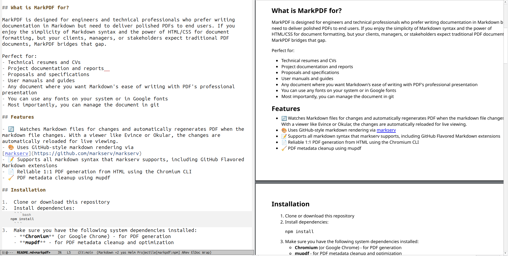

# MarkPDF

A simple **Linux-only** tool to watch Markdown files and automatically generate PDFs using Chromium's print-to-pdf command line interface.

 

## What is MarkPDF for?

MarkPDF is designed for engineers and technical professionals who prefer writing documentation in Markdown but need to deliver polished PDFs to end users. If you enjoy the simplicity of Markdown syntax and the power of HTML/CSS for document formatting, but your clients, managers, or stakeholders expect traditional PDF documents, MarkPDF bridges that gap.

Perfect for:
- Technical resumes and CVs
- Project documentation and reports  
- Proposals and specifications
- User manuals and guides
- Any document where you want Markdown's ease of writing with PDF's professional presentation
- You can use any fonts on your system or in Google fonts
- Most importantly, you can manage the document in git

## Features

- 🔄  Watches Markdown files for changes and automatically regenerates PDF when the markdown file changes. With a viewer like Evince or Okular, the changes are automatically reloaded for live viewing.
- 🎨 Uses GitHub-style markdown rendering via [markserv](https://github.com/markserv/markserv)
- 📝 Supports all markdown syntax that markserv supports, including GitHub Flavored Markdown extensions
- 📄 Reliable 1:1 PDF generation from HTML using the Chromium CLI
- 🧹 PDF metadata cleanup using mupdf

## Installation

1.  Clone or download this repository
2.  Install dependencies:
    ```bash
    npm install
    ```
3.  Make sure you have the following system dependencies installed:
    - **Chromium** (or Google Chrome) - for PDF generation
    - **mupdf** - for PDF metadata cleanup and optimization

### Optional: Create an Alias for Global Usage

To use MarkPDF from any directory, you can create an alias in your shell configuration:

**For Bash (add to `~/.bashrc` or `~/.bash_profile`):**
```bash
alias markpdf='/path/to/markpdf/markpdf'
```

**For Zsh (add to `~/.zshrc`):**
```bash
alias markpdf='/path/to/markpdf/markpdf'
```

**For Fish (add to `~/.config/fish/config.fish`):**
```fish
alias markpdf='/path/to/markpdf/markpdf'
```

Replace `/path/to/markpdf/markpdf` with the actual path to your MarkPDF installation.

After adding the alias, reload your shell configuration:
```bash
source ~/.bashrc  # or ~/.zshrc, ~/.bash_profile, etc.
```

Now you can run MarkPDF from any directory:
```bash
markpdf ~/documents/my-resume.md
markpdf /path/to/any/document.md
```

## Usage

```bash
./markpdf <markdown-file>
```

Examples:
```bash
./markpdf resume.md
./markpdf /path/to/document.md
```

The tool will:
1.  Start a local markserv server to render the markdown as HTML
2.  Generate an initial PDF
3.  Watch the markdown file for changes
4.  Automatically regenerate the PDF when changes are detected

Press `Ctrl+C` to stop watching and clean up.

## Output

The PDF will be saved in the same directory as the input markdown file with the same name but `.pdf` extension.

## Dependencies

- **chokidar**: File watching
- **markserv**: Markdown to HTML rendering with GitHub styling

## Styling

The tool uses custom CSS (`styles.css`) optimized for PDF output with:
- US Letter-size pages
- 0.5 inch margins
- Noto font family
- Proper print styling

You can modify `styles.css` to customize the PDF appearance.

## Customization

MarkPDF provides flexible customization options for both HTML templates and CSS styling. You can customize files either globally (in the MarkPDF directory) or per-project (in your target directory).

### Template Files

MarkPDF uses two template files:
- `index.html` - HTML wrapper that loads your markdown content
- `styles.css` - CSS styles for PDF formatting

### Where to Customize

**Global Customization (MarkPDF Directory)**
- Edit `styles.css` and `index.html` in the MarkPDF installation directory
- Changes apply to all new projects by default
- Useful for organization-wide styling standards

**Per-Project Customization (Target Directory)**
- MarkPDF copies template files to your target directory on first run
- Edit the copied files to customize that specific project
- Changes only affect that particular document

### File Handling Behavior

**On First Run:**
- If `styles.css` doesn't exist in target directory → copies from MarkPDF directory
- If `index.html` doesn't exist in target directory → copies and customizes from MarkPDF directory
- If files already exist → skips copying and shows warning (preserves your customizations)

**During Execution:**
- Watches both the markdown file AND the local `styles.css` for changes
- Automatically regenerates PDF when either file is modified
- Enables live preview of styling changes

**On Cleanup (Ctrl+C):**
- Compares target files with original templates
- **Removes files only if they're identical to templates** (no customizations made)
- **Preserves files that contain any modifications**
- Shows clear messages about what was removed vs. preserved

### Customization Examples

**CSS Customization:**
```css
/* Custom fonts */
body { font-family: 'Times New Roman', serif; }

/* Custom margins */
@page { margin: 1in; }

/* Custom colors */
h1, h2, h3 { color: #2c3e50; }

/* Custom spacing */
p { line-height: 1.6; margin-bottom: 1em; }
```

**HTML Template Customization:**
- Add custom meta tags
- Include additional CSS frameworks
- Add JavaScript for dynamic content
- Modify the document structure

This approach ensures your customizations are never accidentally lost while still keeping directories clean when using default templates.

## PDF Metadata

The script automatically cleans up PDF metadata using mupdf and can embed custom metadata into the generated PDF. To use custom metadata, create a file named `<your-document-name>-metadata.md` in the same directory as your source markdown file.

For example, if you are converting `resume.md`, you should create a `resume-metadata.md` file.

### Metadata Format

The metadata file should contain key-value pairs, with each entry on a new line, separated by a colon (`:`).

Example `resume-metadata.md`:
```
Title: My Resume
Author: John Doe
Subject: Professional Experience
Keywords: Software Engineer, Web Developer, Resume
Creator: MarkPDF
```

### Supported Metadata Fields

The script uses mupdf to clean and embed metadata. Here are some common metadata fields you can use:

- `Title`
- `Author`
- `Subject`
- `Keywords`
- `Creator`
- `Producer`
- `CreationDate` (e.g., `2023:10:27 10:00:00`)
- `ModDate` (e.g., `2023:10:27 10:00:00`)
- `Copyright`

**Note:** This feature requires `mupdf` to be installed on your system. The script uses mupdf's `mutool` command for PDF metadata cleanup and optimization.


